```mermaid
flowchart LR
    A["🖥️ React UI<br/>CustomFields.js"] -->|"GET /rest/custom-fields"| B["🔌 REST Controller"]
    B --> C["⚙️ Service Layer"]
    C --> D["💾 DAO Layer"]
    D --> E["🗄️ PostgreSQL<br/>custom_field<br/>custom_field_value"]
```

## Summary

This PR adds a **configuration-driven custom fields system** to the Sample Entry (Add Order) form, enabling labs to capture additional metadata during sample creation without code changes.

### Backend (5-layer architecture)
- **Database**: Liquibase migration creates `custom_field` and `custom_field_value` tables
- **Entities**: [CustomField](cci:2://file:///c:/Users/princ/OneDrive/Desktop/OpenELIS-Global-2/src/main/java/org/openelisglobal/customfield/valueholder/CustomField.java:13:0-122:1), [CustomFieldValue](cci:2://file:///c:/Users/princ/OneDrive/Desktop/OpenELIS-Global-2/src/main/java/org/openelisglobal/customfield/valueholder/CustomFieldValue.java:14:0-68:1), `CustomFieldType` enum (extends [BaseObject](cci:2://file:///c:/Users/princ/OneDrive/Desktop/OpenELIS-Global-2/src/main/java/org/openelisglobal/common/valueholder/BaseObject.java:28:0-220:1))
- **DAO/Service**: `CustomFieldDAO/Impl`, `CustomFieldValueDAO/Impl`, `CustomFieldService/Impl`, `CustomFieldValueService/Impl`
- **REST API**: [CustomFieldRestController](cci:2://file:///c:/Users/princ/OneDrive/Desktop/OpenELIS-Global-2/src/main/java/org/openelisglobal/customfield/controller/rest/CustomFieldRestController.java:18:0-66:1) at `/rest/custom-fields` (GET, POST, PUT, deactivate)
- **DTO**: [CustomFieldValueDTO](cci:2://file:///c:/Users/princ/OneDrive/Desktop/OpenELIS-Global-2/src/main/java/org/openelisglobal/customfield/dto/CustomFieldValueDTO.java:2:0-30:1) for API data transfer

### Frontend
- [CustomFields.js](cci:7://file:///c:/Users/princ/OneDrive/Desktop/OpenELIS-Global-2/frontend/src/components/addOrder/CustomFields.js:0:0-0:0) — Dynamic React component using Carbon Design System
- Supports 6 field types: STRING, INTEGER, DECIMAL, BOOLEAN, DATE, CHOICE
- Integrated into Add Order wizard on Sample page
- i18n support for English and French

## Architecture

## Architecture

