## Summary

This PR adds a **configuration-driven custom fields system** to the Sample Entry (Add Order) form, enabling labs to capture additional metadata during sample creation without code changes.

### Backend (5-layer architecture)
- **Database**: Liquibase migration creates `custom_field` and `custom_field_value` tables
- **Entities**: `CustomField`, `CustomFieldValue`, `CustomFieldType` enum (extends `BaseObject`)
- **DAO/Service**: `CustomFieldDAO/Impl`, `CustomFieldValueDAO/Impl`, `CustomFieldService/Impl`, `CustomFieldValueService/Impl`
- **REST API**: `CustomFieldRestController` at `/rest/custom-fields` (GET, POST, PUT, deactivate)
- **DTO**: `CustomFieldValueDTO` for API data transfer

### Frontend
- `CustomFields.js` — Dynamic React component using Carbon Design System
- Supports 6 field types: STRING, INTEGER, DECIMAL, BOOLEAN, DATE, CHOICE
- Integrated into Add Order wizard on Sample page
- i18n support for English and French

## Architecture

```mermaid
flowchart LR
    A["🖥️ React UI<br/>CustomFields.js"] -->|"GET /rest/custom-fields"| B["🔌 REST Controller"]
    B --> C["⚙️ Service Layer"]
    C --> D["💾 DAO Layer"]
    D --> E["🗄️ PostgreSQL<br/>custom_field<br/>custom_field_value"]
```

## Screenshots

## Demo Video

https://github.com/user-attachments/assets/652a3448-f662-461f-ac11-f3e186c69f08

## Related Issue

Resolves #2878

## Other

- All backend classes follow existing project patterns (`BaseObject`, `BaseDAOImpl`, `BaseObjectServiceImpl`)
- Backward-compatible — if no custom fields are defined, the section does not render
- Soft-delete support via deactivation to preserve data integrity
- No existing functionality was altered — only new files and minimal integration points
